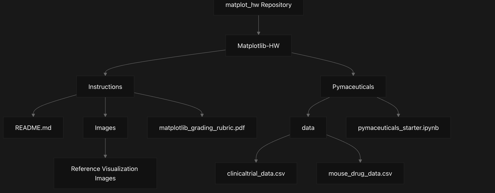
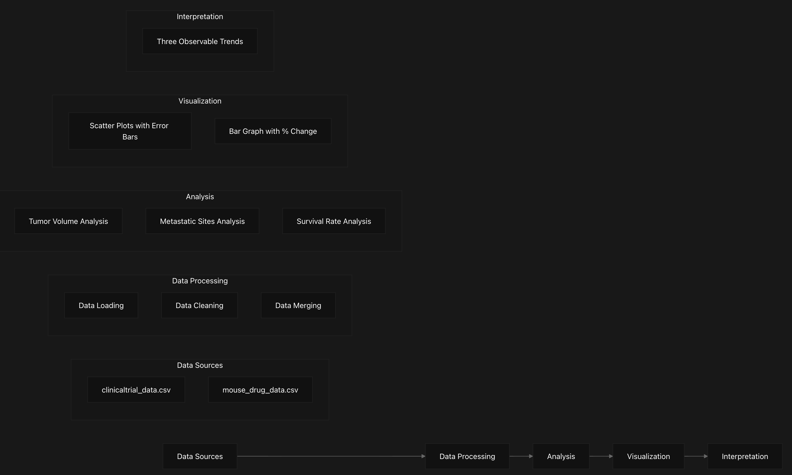
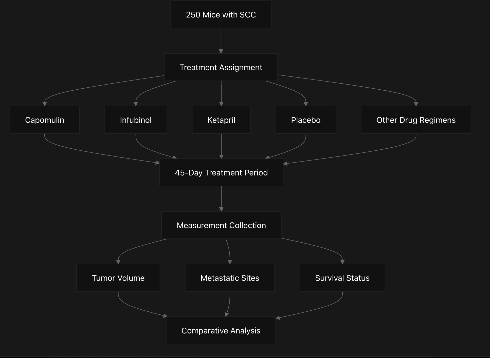

# Overview

## Purpose and Scope
This document provides an overview of the Matplotlib Homework repository, a data analysis and visualization project focused on examining pharmaceutical trial data. The repository contains a set of data files, instructions, and a starter Jupyter notebook for analyzing the efficacy of various drug treatments on squamous cell carcinoma (SCC) in mice.

The project demonstrates the application of Matplotlib for creating informative visualizations from experimental pharmaceutical data, including tumor volume changes, metastatic site development, and survival rates across different treatment regimens.

## Repository Context
The Matplotlib Homework repository represents a comprehensive data analysis assignment that simulates a real-world pharmaceutical research scenario. As described in the instructions, the user takes on the role of a Chief Data Analyst at Pymaceuticals Inc., a pharmaceutical company focusing on anti-cancer treatments.

The primary objective is to analyze data from an animal study involving 250 mice treated with various drug regimens over 45 days, with special focus on comparing four treatments: Capomulin, Infubinol, Ketapril, and Placebo.

## Repository Structure

This diagram illustrates the organization of files and directories within the repository. The main components include:

- Instructions directory: Contains the README.md with project requirements and reference images
- Pymaceuticals directory: Contains the data files and starter Jupyter notebook
- Data files: Two CSV files containing clinical trial data and mouse drug assignment data
- Starter notebook: A Jupyter notebook template with guidance for completing the analysis

## Data Analysis Workflow
This diagram shows the end-to-end data analysis workflow required by the assignment. The process begins with loading the data sources, proceeds through data processing and analysis stages, and culminates in creating visualizations and interpreting the results.

## Required Visualizations
The homework requires the creation of four specific visualizations to effectively analyze and present the pharmaceutical data:

Visualization Type	Purpose	Requirements
Tumor Volume Scatter Plot	Track how tumor volume changes over time	Include error bars for variability between mice
Metastatic Sites Scatter Plot	Track cancer spread over time	Include error bars for variability between mice
Survival Rate Plot	Show number of mice still alive during treatment	Include error bars for variability between mice
Percent Change Bar Graph	Compare total % tumor volume change for each drug	Color code (red for growth, green for reduction) with percentage labels

All visualizations must include proper labeling (titles, axis labels, legends) and follow aesthetic guidelines to ensure clarity and readability.

## Study Design

This diagram illustrates the experimental design of the pharmaceutical study. 250 mice with squamous cell carcinoma were assigned to different treatment groups and monitored over 45 days, with measurements taken of tumor volume, metastatic sites, and survival status.

## Technologies and Dependencies

The project requires the use of specific technologies:

1. Jupyter Notebook: The environment for developing and documenting the analysis
2. Python: The programming language used
3. pandas Library: For data manipulation and analysis
4. Matplotlib Library: For creating visualizations

These technologies work together to enable the loading, processing, and visualization of the pharmaceutical trial data.

## Educational Context
This repository serves as a guided learning experience, challenging users to apply data visualization skills to a complex dataset. The project is designed to develop skills in:

1. Data manipulation and preparation
2. Statistical analysis
3. Data visualization with Matplotlib
4. Scientific result interpretation
5. Problem decomposition and systematic problem-solving

The exercise emphasizes breaking down complex tasks into manageable components and encourages independent research to overcome technical challenges.
